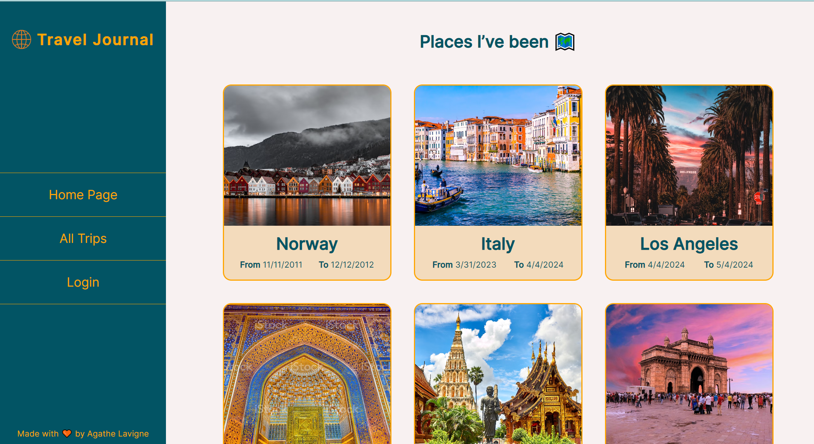
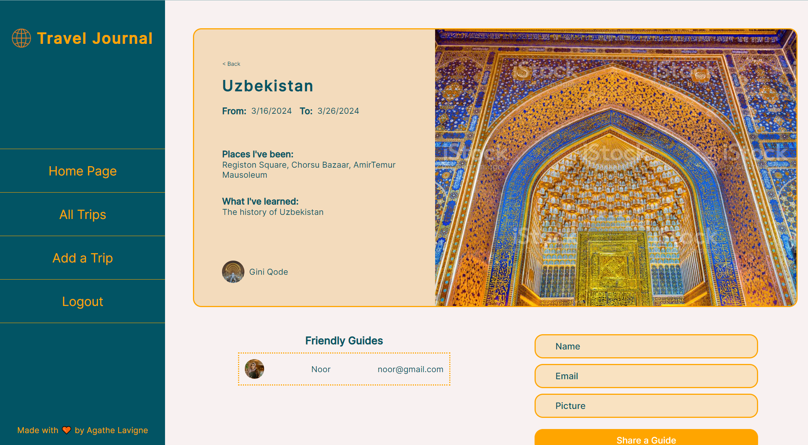
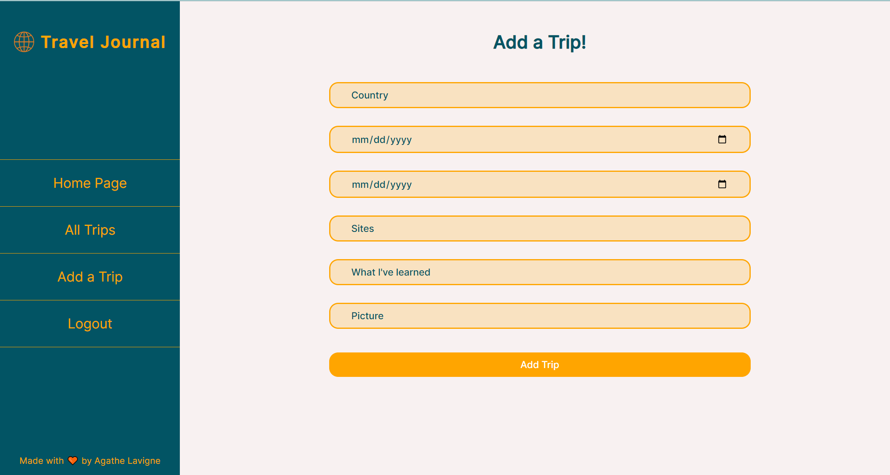

TravelJournal

#About this project

TravelJournal is a full stack solo project. This app consists of keeping travel souvenirs safe and light in your pocket. I began this creation by doing the wireframe, then the ERD followed by my pseudocode and finally applied all those pre-work into practice.

#Wireframe

I used Figma for the wireframe :

<a href="https://www.figma.com/file/EcdBYTQ5D5JVX8FhoIthK5/Travel-Journal?type=design&node-id=0-1&mode=design&t=UMej7w9khMET9suv-0">Link to my Figma</a>

#Pseudocode

I have used Trello to do my pseudocode for this project. All the steps I have been through are on this link: 

<a href="https://trello.com/b/Knhq0sT7/project-2-travel-journal">Link to my Trello</a>

#Results

This is a glimpse of my project. All the CRUD functionality is here, it is also a minimum of responsiveness. 

<a href="https://fathomless-inlet-76834-317446e98998.herokuapp.com/">Link to the App</a>

#Technology used

I have used:

 	-HTML,
	-CSS,
	-JavaScript,
	-EJS,
	-mongoose,
	-mongoDB

#Challenges

The whole project was a challenge, but I really enjoyed it as it built up confidence in my new skills.
The update and delete controllers were the most difficult. I also decided to use reference data in mongoDB so I could practise it more and get more familiar with it. 
Making a website responsive is always more difficult than I thought but if I had more time for this project the responsiveness would be spot on.

#Future Opportunities

-add API of mapBox or google maps for places to go to(feature),
-add loading spinner while the data is been fetch,
-add favourite trip functionality,
-add friendly guide a route/page,
-better CSS.

